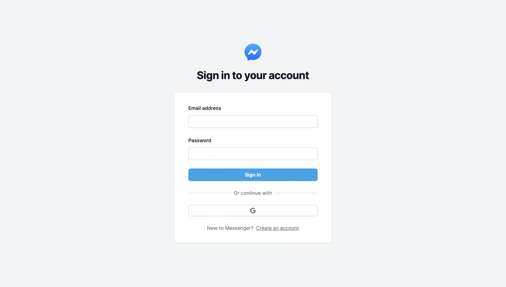
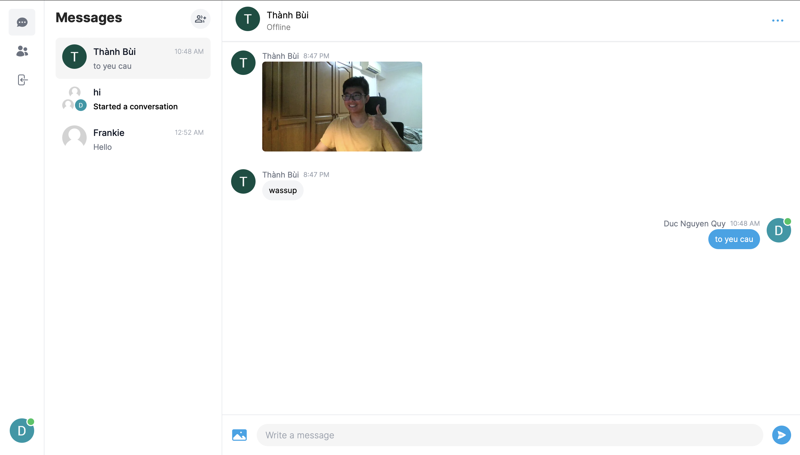

# Messenger Clone

## Tech Stack

- Next 13 (App Router)
- React
- Tailwind
- Prisma
- MongoDB
- Pusher

## Screenshots

_Log In Screen_

_Conversation Screen_

## Key features

### 1. Real-time Communication:

- Utilizes Pusher for instant messaging
- Provides message notifications and alerts

### 2. User Interface:

- Incorporates Tailwind design for a modern and stylish UI
- Employs Tailwind animations and transitions for engaging visuals
- Ensures full responsiveness across various devices

### 3. Authentication Options:

- Implements credential authentication via NextAuth
- Integrates Google authentication

### 4. Media Handling:

- Enables seamless file and image uploads through Cloudinary CDN
- Utilizes react-hook-form for client-side form validation and handling

### 5. Error Management:

- Utilizes react-toast for effective server error handling

### 6. Enhanced Messaging Experience:

- Provides message read receipts for tracking message status
- Indicates user online/offline status for real-time interaction

### 7. Diverse Communication:

- Supports both group chats and one-on-one messaging
- Enables message attachments and file sharing

### 8. Personalization:

- Offers user profile customization and settings

## What I've learnt

### 1. Backend Development:

- Demonstrates creating POST, GET, and DELETE routes in route handlers (app/api)
- Explores establishing relations between server and child components in a real-time environment

### 2. Database Interaction:

- Explains how to directly fetch data in server React components, bypassing APIs

### 3. Real-time Chat Management:

- Covers the creation and management of chat rooms and channels for dynamic interactions

[Back To The Top](#Messenger-Clone)
